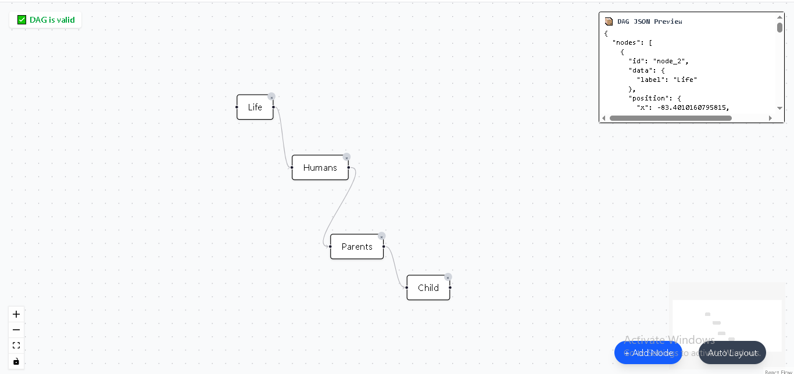
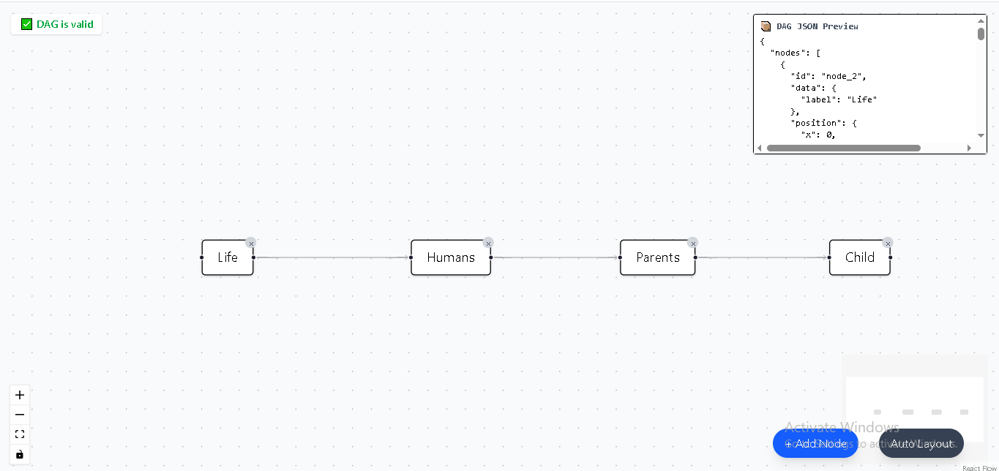
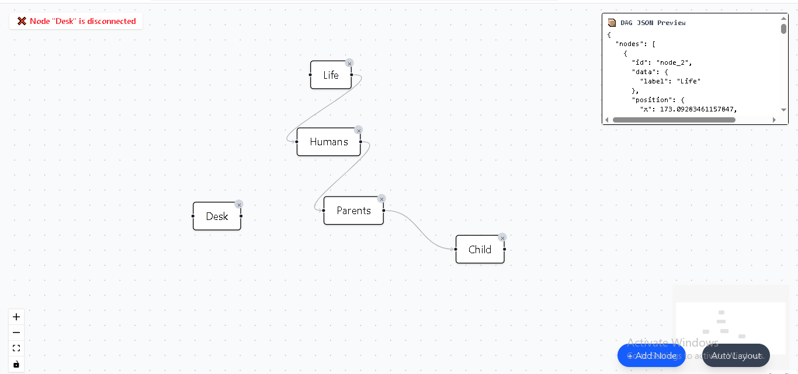

DAG Editor — Nexstem Frontend Assignment

An interactive DAG (Directed Acyclic Graph) editor built with React, React Flow, and Tailwind CSS, supporting custom node creation, edge drawing with direction validation, auto layout, real-time validation, and JSON preview.

🔗 Live Demo: [Vercel Link](https://nexstem-assignment-dag-builder.vercel.app/)

🚀 Setup Instructions

# 1. Clone the repository

git clone https://github.com/AbhishekTiwari14/nexstem-assignment-dag-builder

# 2. Install dependencies

npm install

# 3. Start the development server

npm run dev

# App will run at http://localhost:5173

🧩 Libraries & Decisions

🔧 Core Libraries

React with Vite for fast development and HMR

React Flow to handle node-edge rendering and interactivity

Tailwind CSS for UI styling and layout

Dagre for auto layout of DAGs

🧠 Why These?

React Flow provides excellent node/edge composition, events, and selection APIs.

Dagre is a well-tested library for laying out DAGs top-to-bottom or left-to-right.

Tailwind allows rapid component styling with utility classes, ideal for hackathon/prototype speed.

🧪 Features

✅ Add nodes with custom labels

✅ Drag-and-drop edge creation (right ➝ left only)

✅ Validation to block self-loops and invalid edge directions

✅ Delete node/edge via Delete key or node-level ✕ button

✅ Auto Layout using Dagre (Left-to-Right)

✅ Real-time DAG Validator:

At least 2 nodes

No cycles

No disconnected nodes

✅ JSON Preview panel of current nodes & edges

📷 Screenshots:

🔗 Live Demo: [Vercel Link](https://nexstem-assignment-dag-builder.vercel.app/)

🚧 Challenges Faced

🧩 React Flow

Had to deeply understand how React Flow handles custom nodes, handles, and events.

useReactFlow() error: needed to switch to onInit() with ReactFlowInstance due to internal Zustand store restrictions.

🔁 DAG Validation

Implementing real-time cycle detection and disconnected-node checks required writing a DFS algorithm from scratch.

🎯 Auto Layout

Dagre doesn’t update the React Flow layout directly, so node positions had to be mapped and manually updated.

Ensuring fitView() worked required using the onInit pattern (not useReactFlow).

🧼 UX Decisions

Balanced keyboard interactions with visual delete ✕ icon.

Limited button noise by placing key actions in fixed corners.

🙌 Author

Abhishek Tiwari | f20202118@goa.bits-pilani.ac.in
